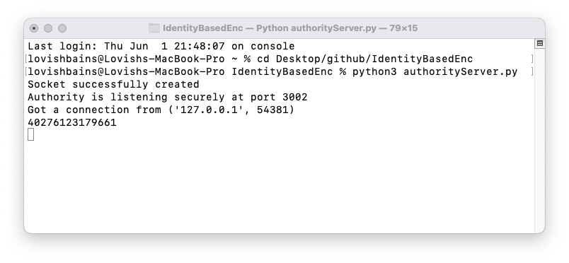
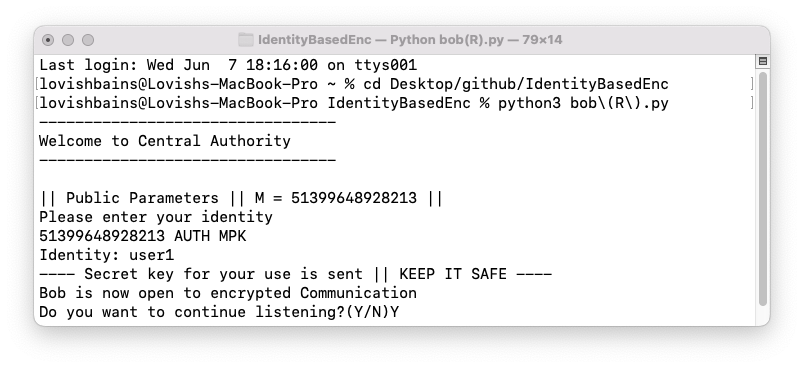
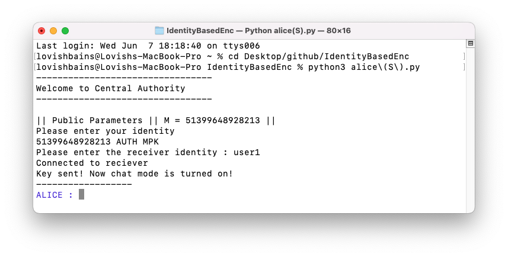
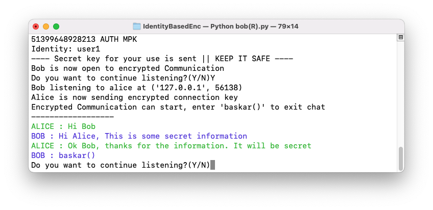
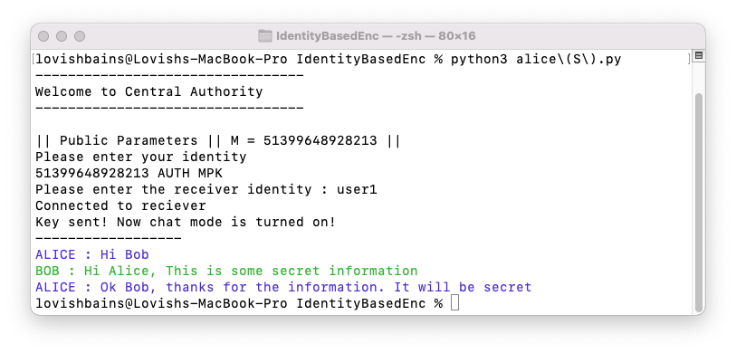
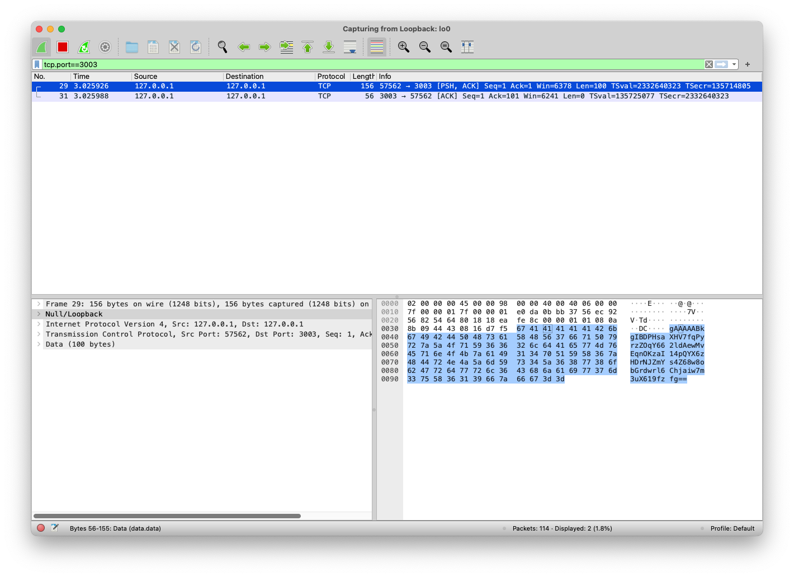
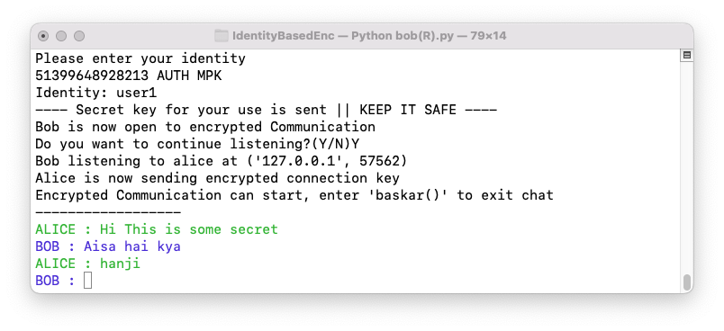

# Implementation of Identity Based Encryption

Identity-Based Encryption (IBE) is a type of public key cryptography that allows a person to use a memorable and easy-to-remember identifier, such as an email address or a phone number, as their public key. This eliminates the need for a separate public key infrastructure (PKI) to manage and distribute public keys.

In IBE, a trusted third party called the Private Key Generator (PKG) generates private keys corresponding to an identity. The user simply provides their identity to the PKG, which then generates their private key. Anyone wishing to send encrypted data to the reciever can do so by encrypting using the easy to remember public key and only the user that has the private key corresponding to the identity can decrypt the information.

One of the main advantages of IBE is its simplicity and ease of use. Since the public key is derived from a user's identity, there is no need for users to manage a separate key pair or exchange public keys with other users. This also makes IBE a suitable choice for applications where the users are not technically proficient.

In conclusion, IBE is a useful alternative to traditional public key cryptography that eliminates the need for a separate PKI. While it has its limitations, it offers simplicity and ease of use for applications where users are not technically proficient or where a PKI is not practical.

## Tools used:

For our implementation of the identity based encryption we are using:

- Python as the programming language
- hashlib module for hashing function
- random module
- socket module for socket programming
- ssl module for using TLS on authority server
- base64 string encodings
- cryptography fernet module for symmtric encryption

## Core Protocol

We are using Clifford Cocks IBE scheme as the core protocol. The complete scheme includes 4 phases which are as follow:

### Setup Phase

The PKG chooses:

1. An RSA modulus n = pq , where p and q are primes and kept secret and follow the below condition.
    
    
    
2. A deterministic Public hash function is chosen, in our case we are using hashlib’s SHA-256 hashing.

### Encrypt Phase

To encrypt a bit (1/0) codes as (+1/-1) m, the user:

1. chooses random t1 with m=(t1/n) ***(Jacobi symbol of t1 wrt n).***
2. chooses random t2 with m=(t2/n) ***(Jacobi symbol of t2 wrt n).***
3. compute c1 and c2 as follows:
    
    
    
    
    
4. send s = (c1,c2) to the user.

### Extract Phase

In the extract phase the users can retrive their private keys corresponding to the identity string provided.

1. PKG derives a value a such that (a/m) ***(Jacobi Symbol of a wrt m)*** is 1 using iterative and deterministic use of hash function until the condition is met.
2. computes the below given value
    
    
    
    such that this satisfies either 
    
    
    
    or
    
    
    
3. Transmits this value r to the user.

### Decrypt Phase

If the user wants to decrypt the ciphertext s for the user’s root, it can be done as follows:

1. computes ɑ = c1 + 2r if r^2 = a  or ɑ = c2 + 2r otherwise.
2. computes m = (ɑ/n) ***(Jacobi symbol of alpha wrt n)***. This is the decrypted bit.

We are using Identity based encryption for key exchange only and using symmetric key encryption for the rest of connection as the using Identity based Encryption alone will use a lot of computation power.

## Directory Structure

- core
    - **authorityRoles.py** : functions for the setup of the authority including choosing RSA modulus and publishing public parameters.
    - **decryptionScheme.py :** functions to decrypt cipher text and sequence of cipher texts
    - **encryptionScheme.py** : functions for the encryption of the plaintext and sequence of plaintexts.
    - **tools.py** : all the mathematical tools required in encryption, decryption and auth setup. These includes jacobiSymbol, identityHashing algorithm, modInverse function, bitsToKey conversion algorithm.
- certificates
    
    This includes self-signed CA certitificates for Transport level security while communicating between user and authority which is sending the private keys
    
- bob.py
    
    code file to be run for receiver in demo. 
    
- alice.py
    
    Code file to be run for sender in demo.
    
- authorityServer.py
    
    code file to setup an authority at a defined port.
    

## Working of the Demo:

For the demo to start we will first run the ***authorityServer.py*** file which will do the following:

1. create a authority instance setting up private and public parameters.
2. open a socket at **PORT 3002** to listen for users wanting to use the infrastructure.
3. The Socket uses SSL and hence the communication between the authority and user is safe from intervention by a third party.
    
    
    

Next up, we will run our reciever file **(bob.py)** which will do the following:

1. Connect to the auth server at port 3002 and verify the CA certificates of the authority against the certificates folder.
2. Recieves the Master Public Key of the PKG and sends its own identity string to the authority for getting its secret key.
3. The Authority then generates the secret key and sends it back to the user. Then the reciever(bob) opens its own socket **(PORT 3003)** for listening for senders to send him data. This socket does not has TLS and we are going to use our own encryption for security.
    
    
    

For the next step we are going to run the sender code **(alice.py)** which will work as follows:

1. First alice will also connect to auth server only to retrieve the Master Public Key and close the connection after that.
2. Alice will then ask for the reciever identity using input() and connect to Bob (which is open for connections at **PORT 3003**) and select a random connection key.
3. The connection key will then be sent to bob using identity based encryption. Once the key is sent and decrypted by bob the chat mode will turn on.
    
    
    

**Chat Mode:**

Once the keys are exchanged we can use fernet library to encrypt and decrypt messages sent between alice and bob. The connection key can be converted to a fernet key using the bits to bytes conversion. Alice and bob can send and recieve messages by taking turns.

Chat mode can be turned off using “baskar()” string.

## Verification ( Packet Sniffing)

To verify that the encryption is working and no third party can access the data we will use Wireshark to look at the communication between auth, bob and alice.

This is the encrypted message corresponding to the communcation shown in the terminal below.